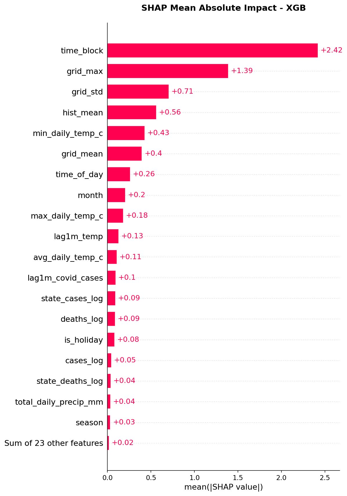
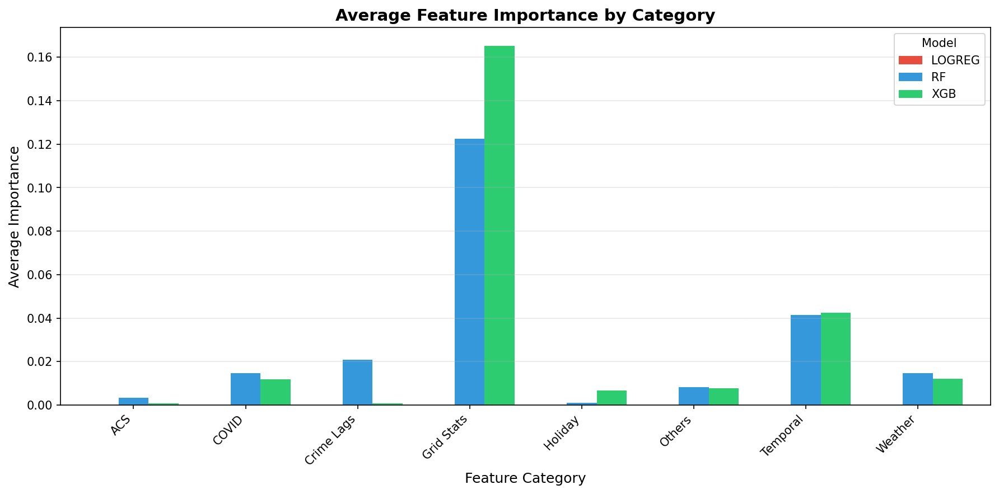
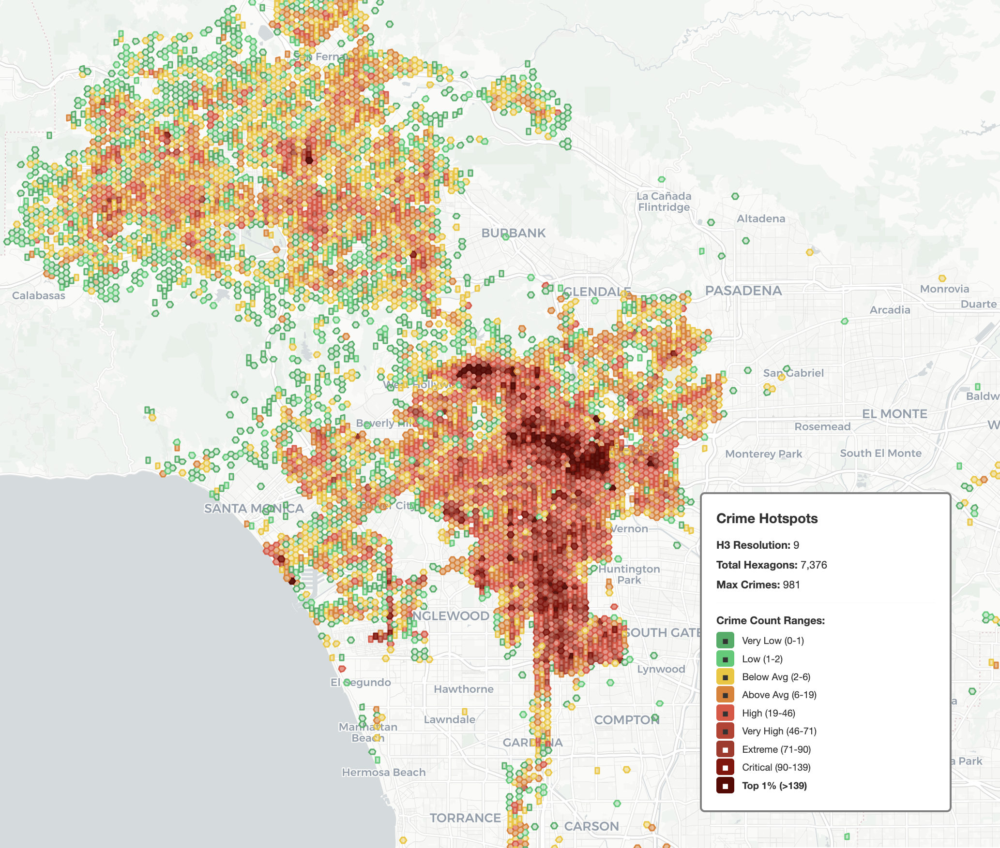
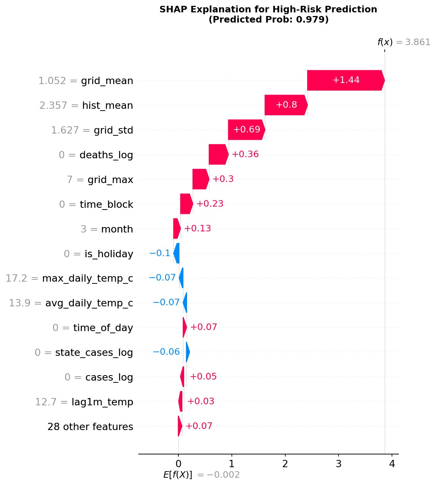
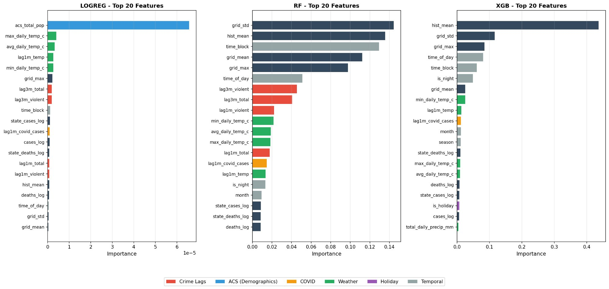
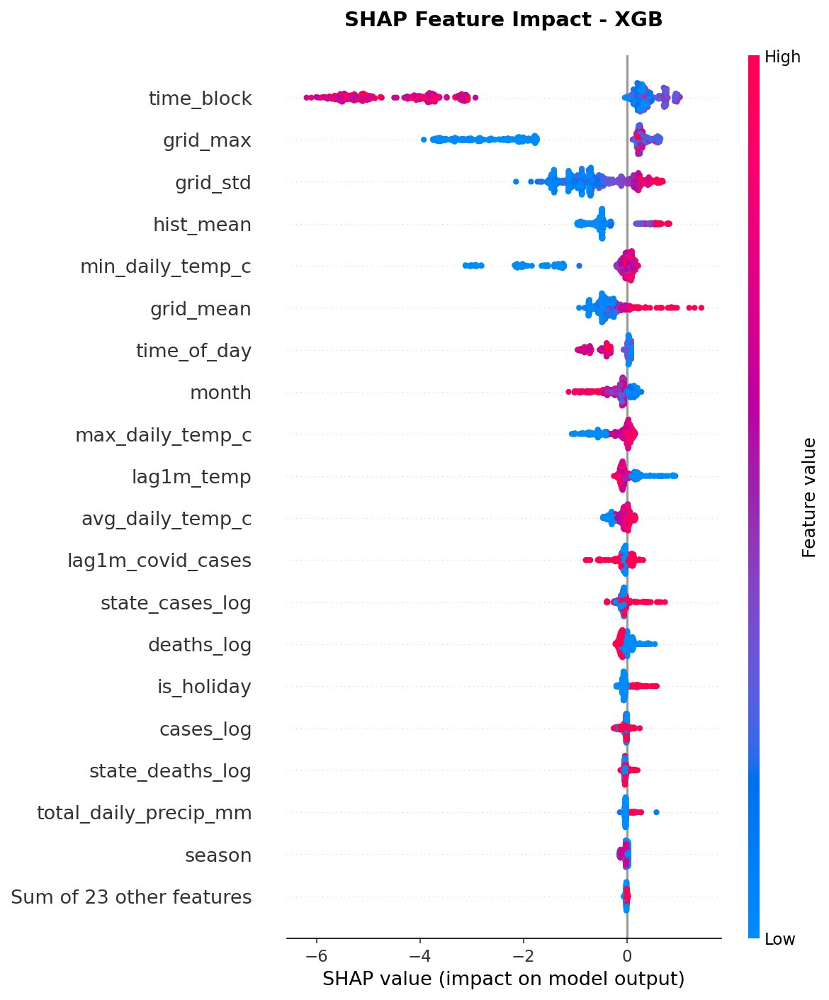

# LA Crime Risk Prediction

> **Where might crime happen next in Los Angeles — and when?**  
> An end-to-end ML pipeline that ingests 1M+ LAPD incidents, engineers spatio-temporal features across H3 hexagonal grids, and trains XGBoost to forecast high-risk zones by location and time block.

---

## Results at a glance

| Model | ROC-AUC | PR-AUC | F1 | Recall |
|-------|---------|--------|----|--------|
| Logistic Regression (baseline) | 0.970 | 0.261 | 0.307 | 0.309 |
| Random Forest | 0.955 | 0.411 | 0.420 | 0.426 |
| **XGBoost (final)** | **0.966** | **0.428** | **0.417** | **0.507** |

XGBoost was selected for its superior recall (50.7%) — correctly flagging half of all actual high-risk zones — and highest PR-AUC under severe class imbalance (~2% positive rate).

---

## Key findings

**`time_block` is the single strongest predictor** (SHAP mean |impact| +2.42), followed by grid-level crime history (`grid_max` +1.39, `grid_std` +0.71, `hist_mean` +0.56). Risk spikes sharply after 3 PM and peaks between 6 PM and midnight.



**Grid Stats dominate across all three models.** Temporal features rank second. ACS demographics and COVID data add marginal but statistically confirmed signal (all 20 top features confirmed by Boruta).



**Crime is spatially concentrated, not uniformly distributed.** The H3 hexagonal map (resolution 9, ~0.1 km² per cell) across 7,376 hexagons shows dense hotspots around Downtown LA, Hollywood, and South LA — confirming that localised socioeconomic and environmental factors drive clustering.



**Individual predictions are fully explainable.** The waterfall below shows a high-risk prediction (probability 0.979): `grid_mean` (+1.44), `hist_mean` (+0.80), and `grid_std` (+0.69) push the score up from a near-zero baseline — the model is not a black box.



---

## Project structure

```
la-crime-risk-prediction/
├── data/
│   └── README_data.md          # how to obtain the datasets
├── docs/
│   └── images/                 # all output plots
├── outputs/                    # generated maps and CSVs (git-ignored)
├── src/
│   ├── config.py               # all hyperparameters in one dataclass
│   ├── preprocess.py           # load, parse timestamps, filter violent crimes
│   ├── features.py             # H3 grid aggregation, lag features, panel construction
│   ├── clustering.py           # KMeans elbow + DBSCAN hotspot labeling
│   ├── modeling.py             # Logistic / RF / XGBoost + Boruta feature selection
│   ├── explain.py              # SHAP, ALE, feature importance plots
│   └── h3map.py                # interactive Folium/H3 hotspot maps
├── pipeline.ipynb              # end-to-end walkthrough (run top to bottom)
├── requirements.txt
└── README.md
```

---

## Data sources

| Dataset | Source | Size |
|---------|--------|------|
| LAPD Crime Data 2020–2023 | [LA Open Data](https://data.lacity.org/Public-Safety/Crime-Data-from-2020-to-Present/2nrs-mtv8) | 1,004,991+ rows |
| American Community Survey (ACS) | [BigQuery public datasets](https://console.cloud.google.com/bigquery?p=bigquery-public-data&d=census_bureau_acs) | Census block group level |
| LA County COVID Cases | [LA Open Data](https://data.lacounty.gov/) | Daily counts |
| NOAA GHCN Weather (LA station) | [NOAA](https://www.ncdc.noaa.gov/cdo-web/) | Daily TAVG / TMAX / TMIN / PRCP |

**Geocoding:** Incidents without lat/lon were matched via a two-stage pipeline — Census Geocoder API (primary) → OpenStreetMap Nominatim (fallback) — achieving 92% coverage (924k / 1M rows).

Raw data files are not committed to this repo. See `data/README_data.md` for download instructions.

---

## Quickstart

```bash
git clone https://github.com/<your-handle>/ml-projects.git
cd ml-projects/la-crime-risk-prediction

pip install -r requirements.txt

# Place your CSV at data/crime_with_acs_and_more.csv, then:
jupyter notebook pipeline.ipynb
```

All steps — preprocessing, clustering, feature engineering, training, SHAP analysis, and map generation — run sequentially inside `pipeline.ipynb`. Intermediate outputs are cached to `outputs/` so individual cells can be re-run without reprocessing the full dataset.

---

## Pipeline overview

```
Raw LAPD CSV
    │
    ▼
preprocess.py       Parse timestamps · filter violent crimes · spatial clean
    │
    ▼
clustering.py       KMeans elbow · DBSCAN hotspot labeling → cluster_label feature
    │
    ▼
features.py         H3 grid aggregation · 1m/3m lag counts · ACS join
                    weather join · COVID log-transform · panel construction
    │
    ▼
modeling.py         Temporal train/test split (2022–2023 train, last 30 days test)
                    Boruta feature selection · LR → RF → XGBoost
                    TimeSeriesCV · GridSearchCV hyperparameter tuning
    │
    ▼
explain.py          SHAP summary + force plots · ALE curves · feature importance
    │
    ▼
h3map.py            Interactive Folium maps (full / top 20% / top 5% / top 1%)
```

---

## Modeling decisions

**Why grid × time-block instead of raw incidents?**  
Predicting individual incidents is intractable. Aggregating to H3 resolution-9 hexagons (~0.1 km²) × 3-hour time blocks reduces the space to a manageable panel while preserving spatial and temporal granularity.

**Why XGBoost over Random Forest?**  
Under severe class imbalance (~2% positive rate), recall matters more than overall accuracy. XGBoost's `scale_pos_weight` and PR-AUC–focused tuning (`eval_metric='aucpr'`) outperform RF on both PR-AUC (0.428 vs 0.411) and recall (50.7% vs 42.6%).

The feature importance comparison below shows that while all three models agree on the dominance of grid-level statistics, XGBoost assigns substantially higher weight to `hist_mean` and cleaner separation across categories.



**Why Boruta for feature selection?**  
Boruta is run in analysis mode (`use_boruta_for_training = False`) to validate features against random shadow variables. All 20 top features were confirmed as significant — none rejected.

The beeswarm below shows how each feature value (red = high, blue = low) maps to its SHAP impact — high `time_block` values push predictions strongly negative (low risk, early morning), while high `grid_mean` consistently drives risk up.



**Why TimeSeriesCV instead of k-fold?**  
Crime is time-dependent. Random k-fold leaks future information into training folds. `TimeSeriesSplit` with 5 splits preserves temporal ordering and gives realistic held-out estimates.

---

## Configuration

All parameters live in `src/config.py` as a single `Config` dataclass — no scattered magic numbers across files.

```python
from src.config import Config

cfg = Config(
    since="2022-01-01",              # training window start
    end="2023-12-31",                # training window end
    h3_res=9,                        # hexagon resolution (~0.1 km²)
    dbscan_eps=0.0025,               # ~250m in degrees
    use_boruta=True,                 # run Boruta analysis
    use_boruta_for_training=False,   # use all features for final model
    use_time_series_cv=True,         # TimeSeriesSplit evaluation
    cv_n_splits=5,
)
```

---

## Tech stack

Python · pandas · scikit-learn · XGBoost · SHAP · PyALE · Boruta  
Folium · H3 · Plotly · Google BigQuery · NOAA API · Census Geocoder API

---

## Team

Yu-Huan Yu · I-Ming Huang · Yi-Hsien Lou  
DSCI 558 Final Project — University of Southern California